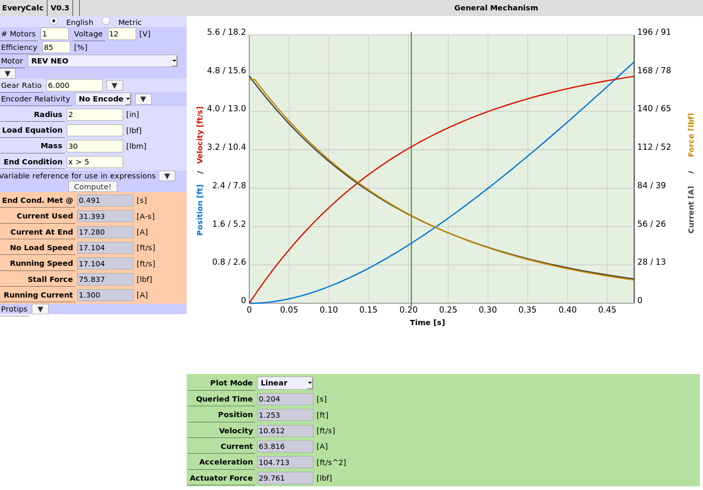

# [EveryCalc](https://thaddeus-maximus.github.io/swissarmyengineer/)
A set of analysis tools for common circumstances ranging from slightly annoying, to very complex.

Inspired by the countless [JVN Calc](https://johnvneun.com/blog/2019/12/24/jvn-calc-past-and-future) clones, this aims to (maybe) put an end to the cloning, and accomplish some other awesome things in the process.

# Aims Accomplished
- Complex and targeted analysis tools to make mechatronic systems
 - Flywheel-based launchers
 - Generalized motorized mechanism
 - Belt sizing
 - Trajectory simulation
 - Rocker pods

- Basic structural analysis tools
 - Beam deflection and stress tool

- An o-ring groove calculator

- Interactivity with a sleek but simple UX 
- Exportable/savable as a future and portable reference (self-contained files, or at least generation thereof)
- English and metric units (in orders of magnitude that are... reasonable... for my uses)

# Aims on the Horizon
- Clean everything the hell up and document it
- Transmission strength calc
- Transient pneumatic cylinder model
- Barrowman stability calculator

# I want to help write things! (Whether or not they're on your roadmap)
Awesome! Let me know, fork this repo, then take a look at the [belt size source code](beltsize.html). It's got some comments about what's going on.

# Documentation

- [Rocker Pod Model](docs/rocker_pod_model.pdf)
- [Adiabatic Cylinder Model](docs/adiabatic_cylinder_model.pdf)
- [Belt Calculator](docs/beltcalc.pdf)
- [Beam Tool](docs/beamcalc.pdf)
- [Wheel Pitchers](docs/pitchers.pdf)

# Credits
Using [mathjs](https://mathjs.org/) for beam calculator (as some rudimentary FEA is performed).

